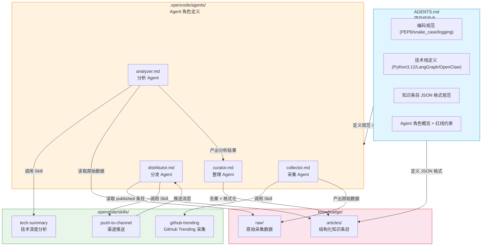

# 项目四大模块关系流程图



## 关系说明

| 关系 | 说明 |
|------|------|
| **AGENTS.md → Agents** | 定义编码规范、技术栈、JSON 格式和红线，所有 Agent 共享此上下文 |
| **AGENTS.md → articles/** | 定义知识条目的 `id`/`title`/`source_url`/`summary`/`tags`/`status` 等字段格式 |
| **collector → github-trending Skill** | 采集 Agent 通过 `skill("github-trending")` 加载采集工作流指令 |
| **collector → raw/** | 采集结果写入 `knowleadge/raw/`，如 `github-trending-2026-05-17.json` |
| **analyzer → tech-summary Skill** | 分析 Agent 通过 `skill("tech-summary")` 加载分析流程 |
| **analyzer → raw/** | 读取 `knowleadge/raw/` 中最新的采集数据 |
| **analyzer → curator** | 分析结果作为中间数据传递给整理 Agent（不应直接写文件） |
| **curator → articles/** | 去重审核后将标准化 JSON 写入 `knowleadge/articles/{id}.json` |
| **distributor → articles/** | 读取 `status: published` 的条目进行渠道分发 |
| **distributor → push-to-channel Skill** | 调用推送技能将内容发至 Telegram/飞书 |

## 数据流向

```
collector ──(产出)──▶ raw/ ──(消费)──▶ analyzer ──(中间数据)──▶ curator ──(格式化)──▶ articles/ ──(消费)──▶ distributor ──▶ Telegram/飞书
```
